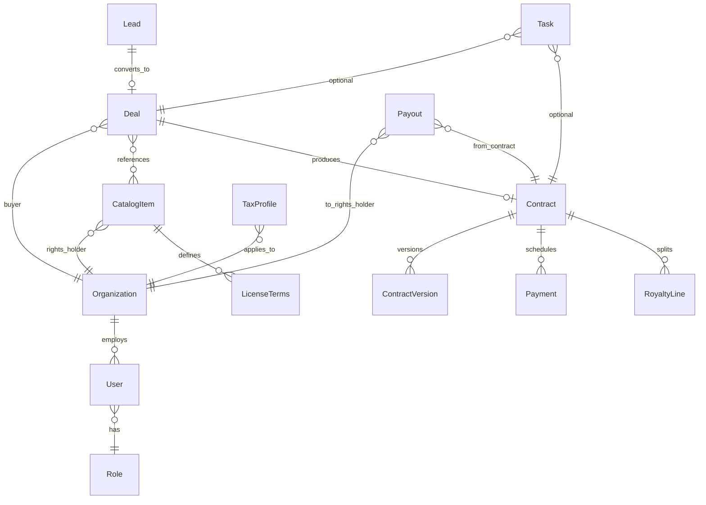

# Доменная модель ContentFlow

## Диаграмма (логическая)

## Ключевые сущности

### Organization

Юридическое или физлицо-контрагент: клиент, правообладатель, наша компания.

- `id`, `legal_name`, `country`, `tax_id`, `is_resident` (справочно), `type` (client | rights_holder | internal).

### User

- `id`, `organization_id` (nullable для внутренних), `email`, `role`, `locale`.

### CatalogItem (RightsHub)

- `id`, `title`, `slug`, `asset_type`, `rights_holder_org_id`
- `metadata` (длительность, ISRC/внутренние коды)
- `status`: `draft` | `active` | `archived`

### LicenseTerms (MUST — привязка прав к объекту)

Может быть несколько «пакетов» на один объект (например VOD non-exclusive СНГ vs exclusive KZ).

- `territory_code` (ISO + кастом `CIS`, `WORLD`)
- `start_at`, `end_at` или `duration_months`
- `exclusivity`: enum
- `platforms`: массив enum
- `sublicensing_allowed`: bool
- `language_rights`: enum или список (`original`, `dub_ru`, `sub_ru`, …)

### Deal

- `id`, `title`, `stage`: `lead` | `negotiation` | `contract` | `paid`
- `owner_user_id`, `buyer_org_id`, `currency`
- `expected_close_at`, `actual_close_at`
- `catalog_item_ids[]`, `commercial_snapshot` (JSON — зафиксированные условия на момент перехода в contract)

### Contract

- `id`, `deal_id`, `number`, `status`: `draft` | `signed` | `expired`
- `territory`, `term_end_at`, `amount`, `currency`
- `fx_rate_fixed` (nullable), `fx_rate_source`, `fx_locked_at`
- `rights_payload` (денормализованный срез LicenseTerms для юридической фиксации)

### ContractVersion

- `contract_id`, `version`, `storage_key` (S3 path), `sha256`, `created_at`, `template_id`, `signed_at`

### Payment (входящий)

- `contract_id` или `deal_id`, `direction`: `inbound` | `outbound`
- `amount`, `currency`, `due_at`, `paid_at`, `status`

### RoyaltyLine

- `contract_id`, `rights_holder_org_id`, `model`: `fixed` | `percent`
- `percent` или `fixed_amount`, `base`: `gross` | `net` | `collections` (настраиваемо)

### Payout (исходящий правообладателю)

- `royalty_line_id`, `amount_gross`, `withholding_tax_amount`, `amount_net`, `currency`
- `tax_profile_snapshot_id` — снимок правил на дату расчёта

### TaxProfile

Привязка к организации-получателю выплаты.

- `jurisdiction` (KZ, RU, …)
- `is_tax_resident_in_payer_country` (bool)
- `dt_certificate_present` (наличие ДВН)
- `withholding_rate_override` (nullable — если задано вручную юристом)
- `residency_certificate_storage_key`, `valid_until`

### Task

- `assignee_id`, `due_at`, `type`: `contract_expiry` | `payment_due` | `renewal` | `custom`
- `linked_entity_type`, `linked_entity_id`

## RBAC (матрица — укрупнённо)

| Действие | admin | manager | rights_owner | client |
|----------|:-----:|:-------:|:------------:|:------:|
| Каталог: создание и публикация | да | черновики и назначенные позиции | только свой контент | read по сделке |
| Сделки (все в тенанте) | да | да | нет | read свои |
| Контракты | да | да, в рамках политики | read по своему контенту | read свои |
| Финансы (агрегаты) | да | ограниченно | только свои выплаты | свои счета |
| Настройки и интеграции | да | нет | нет | нет |

Реализация: claims в JWT (`sub`, `org_id`, `role`, `scopes`) + серверная проверка на каждом запросе.
